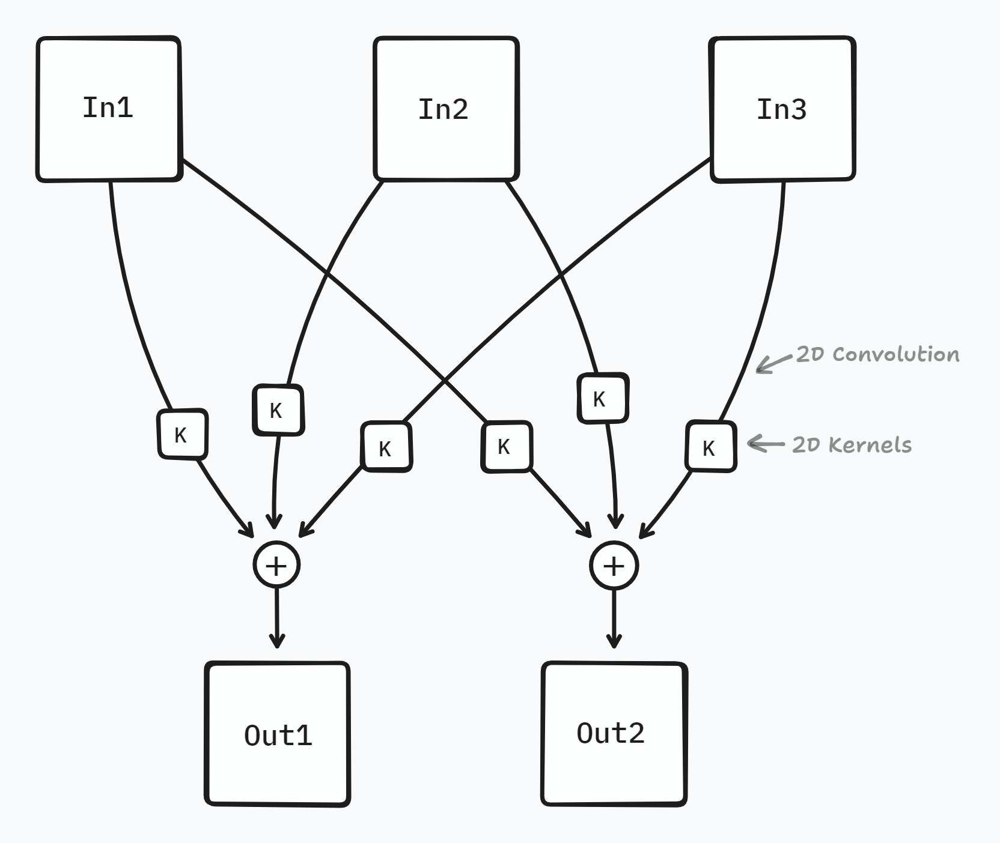
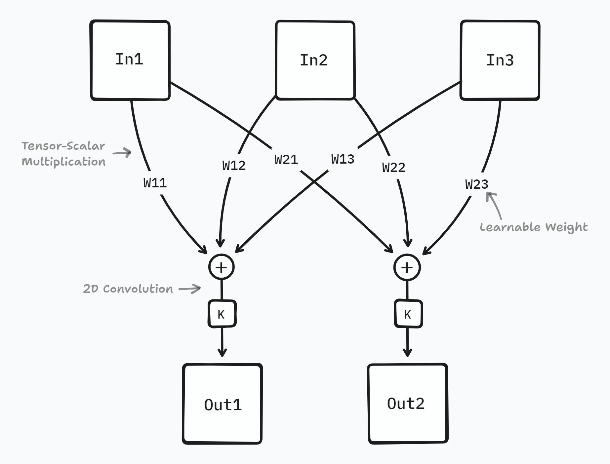
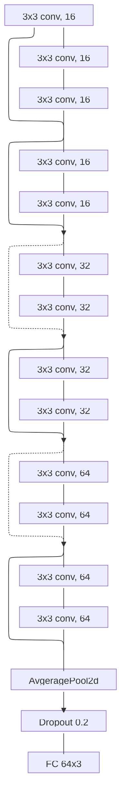
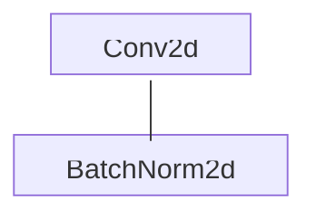
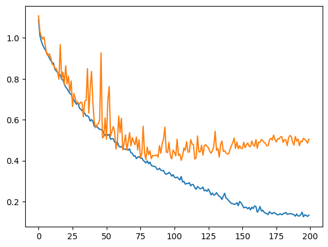
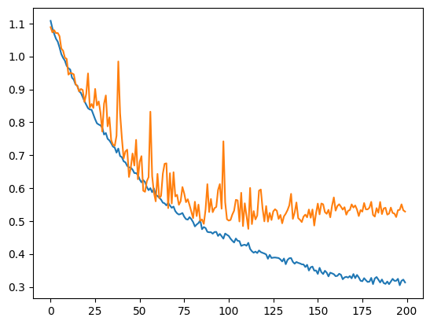

# Introduction 

This is a simple deep learning project focusing on optimizing PyTorch code to perform better with GPU. It is also an exploration with Convolutional Neural Network (CNN) achitecture, specifically [ResNet][5]. 

<!-- - Conv2d with Bias = False and BatchNorm2d after
- Avoid synchronization
- Led to further experiment with different type of convolution layer -->

# PyTorch basic GPU optimizations

The code for training a deep CNN model is modified following the "Performance Tuning Guide" [[6]] to fully utilize available GPUs. The training speed was improve significantly [-- just trust me][7].

# Sub-kernels vs Channels Selection Convolution Layer

A typical Conv2d layer (with groups=1) uses individual **sub-kernels** on each input channels then add up the result for an output channel. This repeat for every out-channels in a layer. 

<div align='center' style='padding: 0 20%;'>


Sub-kernels based convolution (torch Conv2d with groups=1)

</div>

The learnable weights of a Conv2d module follows the shape:

$$
\begin{equation} 

    (\texttt{out\_channels}, \frac{\texttt{in\_channels}}{\texttt{groups}},  \texttt{k\_rows}, \texttt{k\_cols})

\end{equation}
$$

where, by default, $\texttt{groups}=1$ [[1]]. And base on $(1)$ the total number of trainable parameters (not including bias) would be:

$$
\begin{equation} 

\texttt{in\_channels} 
\times \texttt{out\_channels} 
\times \texttt{k\_rows} 
\times \texttt{k\_cols}

\end{equation}
$$

Instead of applying multiple sub-kernels for each output channels, all input channels is weighted sum multiple times for the total of output channels. Each weighted sum uses different set of learnable weights to achieve the idea of input **channels selection** for specific output channels. Individual kernels (with the size of output channels) is then applied to each weighted sum channels.

<div align='center' style='padding: 0 20%;'>


Channels selection convolution (weighted sum over the input channels for each output channels)

</div>

The total learnable parameters for this convolution layer is (without bias):

$$
\begin{equation}

\texttt{in\_channels} 
\times \texttt{out\_channels} 
+ 
\texttt{out\_channels} 
\times K

\end{equation}
$$

where $K= \texttt{k\_rows} \times \texttt{k\_cols}$. Expression $(2)$ is larger than $(3)$ for any $\texttt{in\_channels} > \frac{K}{K-1}, K\neq0$. For a typical $3\times 3$ kernels layer, the input channels need to be larger than $9/8 \approx 1$.

Proof:
$$
\begin{split}

\texttt{assuming } (1) & > (2) \\
\\
I\cdot O\cdot K & > I\cdot O + O \cdot K \\
I\cdot K & > I + K \\
I( K - 1) & > K \\
I & > \frac{K}{K - 1}, K \neq 0 \\

\end{split}
$$

# Implementation

```py
import torch.nn as nn

class WeightedSumConv2d(nn.Module):
    def __init__(self, in_channels, out_channels):
        # use pytorch Linear layer for channels selection (weighted sum)
        self.fc = nn.Linear(
            in_channels, 
            out_channels, 
            bias=False)

        # use pytorch Conv2d with groups=out_channels for convolution
        self.conv2d = nn.Conv2d(
            out_channels, 
            out_channels, 
            # additional arguments
            groups=out_channels)

    # (N = batch size, C_in = in_channels, C_out = out_channels)
    #                                   shape of x:
    def forward(self, x):               # (N, C_in,  W, H    )
        x = x.permute(0, 2, 3, 1)       # (N, W,     H, C_in )
        x = self.fc(x)                  # (N, W,     H, C_out)
        x = x.permute(0, 3, 1, 2)       # (N, C_out, W, H    )
        return conv2d(x) 
```

# Test Run

The idea of channels selection is tested on the dog-vs-cat-vs-bird dataset [[3]] against the sub-kernels convolution. The dataset consists of 12k training images divided evenly among three classes (dog, cat, and bird), each input image has the dimension of 32x32. 

There were many iterations between model shapes and depth but the final implementation settle with the following configuration:

<div align='center' style='margin: 0 auto; width: 50%;'>



</div>

Each conv are: sub-kernels/channel-selection + batchnorm2d


<div align='center' style='margin: 0 auto; width: 100%;'>



Conv2d: Sub-kernels or Channels selection

</div>

This ResNet inspired model is implemented twice for each type of convolution layer, by replacing the Conv2d. Jupyter notebooks for both implementations can be found in [`notebooks/`](/notebooks/).

| Models                                | Channels selection + Kernels | Sub Kernels           |
| ------------------------------------- | --------------------------- | --------------------- |
| Parameters (custom)                   | 27,363                      | 174,787               |
| Overfitting Epoch                     | ~80 (~50 val loss)          | ~80 (~0.42 val loss)  |
| Min Test Loss                         | 0.47613 (train: 0.43)       | 0.40116 (train: 0.32) |
| Submission Score                      | 81.53%                      | 84.17%                |
| ResNet18 Parameters (performance TBD) | ~1,958,824                  | 11,689,512 [[2]]      |

> [!NOTE]
> Learnable parameters for ResNet18 with channels selection is calculated by replacing all Conv2d module with the WeightedSumConv2d module.

<div style='display: flex;'>
<div align='center'>



sub-kernels convolution based (blue: train losses, orange: validation losses)

</div>
<div align='center'>



channels selection convolution based (blue: train losses, orange: validation losses)

</div>
</div>

# Conclusion

## Training speed (pytorch)

Although the Conv2d with channels selection required less computations with lower numebr of learnable parameters, the training time take around twice longer (for small epochs) than with normal Conv2d layer.

| Runs          | Channels selection time (s/10epochs) | Sub kernels (s/10epochs) |
| ------------- | ------------------------------------ | ------------------------ |
| 1             | 85.455                               | 48.41                    |
| 2             | 85.3                                 | 49.54                    |
| 3             | 84.816                               | 47.89                    |
| 4             | 84.854                               | 47.66                    |
| 5             | 85                                   | 47.15                    |
| Avg (s/epoch) | 8.5085                               | 4.81286                  |

This might be due to the unoptimized and, in a way, unconventional operations required (tensor weighted sum, etc). 

> [!NOTE]
> Using `torch.compile` might help improve the the training speed but Kaggle's GPU was older than the required version for `torch.compile`. Thus it is worth running the model on a different machine.

## The ability to learn

It's natural to think that channels selection should performs worse than ordinary sub-kernels-based conv2d, which it did during the dog-cat-bird test. But a bigger problem occur during the experiments. The model with channels selection conv2d seem to be incapable of overfitting and unable to surpass a certain loss value, . This might depend on the high-level achitecture of the model and many other imperfection. 

Base on the performance from the dog-cat-bird dataset [[3]], it is self to say that the channel selection conv2d model perform worst than the ordinary sub-kernels convolution based model. The idea of channels selection convolution need to be tested with different benchmark/dataset.

It is also worth noting that throughout the experiment, different model shapes and hyperparameter were tested. But most, if not all, of the run has shown that the channels selection convolution is incapable to surpass a certain validation loss. Even in the case of intentionally overfitting the dataset. Further understanding of CNN required to tune a model with this convolution layers.


[1]: https://pytorch.org/docs/stable/generated/torch.nn.Conv2d.html#conv2d
[2]: https://pytorch.org/vision/main/models/generated/torchvision.models.resnet18.html
[3]: https://www.kaggle.com/competitions/dog-vs-cat-vs-bird/data
[4]: https://www.kaggle.com/competitions/dog-vs-cat-vs-bird
[5]: https://arxiv.org/abs/1512.03385
[6]: https://pytorch.org/tutorials/recipes/recipes/tuning_guide.html
[7]: https://www.goodreads.com/book/show/217389518-just-trust-me